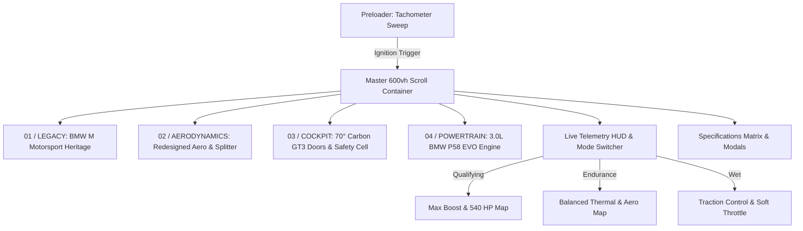

<div align="center">

# 🏎️ BMW M4 GT3 EVO
### Digital Showcase & Interactive Telemetry Experience

[](https://bmw-gold-gamma.vercel.app/)
[](https://github.com/shajith23/bmw)

[](https://nextjs.org/)
[](https://reactjs.org/)
[](https://www.typescriptlang.org/)
[](https://tailwindcss.com/)
[](https://www.framer.com/motion/)
[](https://lenis.darkroom.engineering/)
[](https://bmw-gold-gamma.vercel.app/)

<p align="center">
  <b>An ultra-premium, scroll-driven 360° interactive web application built for the BMW M4 GT3 EVO customer racing car.</b><br>
  Featuring canvas-rendered image sequences, real-time cockpit telemetry HUDs, dynamic drive mode maps, and Web Audio API engine sound synthesis.
</p>

[🌐 Visit Live Showcase](https://bmw-gold-gamma.vercel.app/) • [🏎️ Explore Features](#-key-features) • [🛠️ Tech Architecture](#%EF%B8%8F-technology-stack) • [🚀 Local Setup](#-getting-started)

---

</div>

## 🌐 Live Preview

> **🔗 Live URL:** [https://bmw-gold-gamma.vercel.app/](https://bmw-gold-gamma.vercel.app/)  
> **📦 Repository:** [https://github.com/shajith23/bmw](https://github.com/shajith23/bmw)

---

## 🌟 Key Features

### 🔄 1. 600vh Master Scroll Canvas
- **High-FPS 360° Rotation**: Driven by a 192-frame high-resolution sequence rendered on an HTML5 2D Canvas context.
- **Scroll Syncing**: Direct frame interpolations attached to a 600vh sticky scroll container via Framer Motion `useScroll`.

### ⚡ 2. Motorsport Telemetry & Drive Modes
Live cockpit HUD tracking race parameters across 3 distinct engine & aero profiles:
- 🔴 **QUALIFYING**: Maximum attack map — 540 HP, max turbo boost, high G-force telemetry, aggressive visual theme.
- 🔵 **ENDURANCE**: Stint efficiency map — Optimized fuel & tire thermal load, balanced downforce metrics.
- 🟡 **WET**: Rain setup — Softened throttle response, rain overlay effects, maximum traction control telemetry.

### 🔊 3. Web Audio API Sound Engine
- Custom browser-based audio synthesizer producing realistic **engine revs**, **turbo spooling**, and **gear shift clicks**.
- Dynamic pitch and gain modulations linked to drive mode toggles and user interactions.

### ⏱️ 4. Interactive Preloader
- Motorsport tachometer startup sequence featuring an animated RPM needle sweep, digital telemetry checks, and a manual engine ignition trigger.

### 📑 5. Technical Data & Customer Racing Modals
- **Technical Specs Modal**: Homologated FIA GT3 EVO engine specs, chassis details, transmission ratio, and aerodynamics package.
- **Inquire Modal**: Motorsport customer racing quote request flow with custom input components.

---

## 🎨 Design System & Color Palette

Built around **BMW M Motorsport** visual heritage and premium dark/light contrast styling:

| Palette Color | Hex Code | Purpose |
| :--- | :--- | :--- |
| **Alpine White** | `#FFFFFF` | Canvas base & clean background contrast |
| **M Dark Navy** | `#111111` | Cockpit typography & telemetry container |
| **M Light Blue** | `#0066B1` | Endurance mode accents & active indicators |
| **M Dark Blue** | `#002B49` | Secondary M brand contrast |
| **Motorsport Red** | `#E52521` | Qualifying mode & high-RPM tachometer warnings |

---

## 🛠️ Technology Stack

| Category | Technology | Usage in Project |
| :--- | :--- | :--- |
| **Core Framework** | [Next.js 14 (App Router)](https://nextjs.org/) | Server-side rendering, routing, asset optimization |
| **Language** | [TypeScript 5](https://www.typescriptlang.org/) | Type-safe data structures for phases & specs |
| **Styling** | [Tailwind CSS v4](https://tailwindcss.com/) | Modern utility styling & CSS variables |
| **UI Motion** | [Framer Motion 11](https://www.framer.com/motion/) | Phase reveals, telemetry popups, modal transitions |
| **Smooth Scroll** | [Lenis](https://lenis.darkroom.engineering/) | Inertial smooth scrolling physics |
| **Canvas & Graphics** | HTML5 2D Canvas / Three.js | 192-frame 360° image sequence rendering |
| **Audio Engine** | Web Audio API | Real-time sound synthesis (`soundEngine`) |
| **Icons** | Lucide React | Clean, scalable vector interface icons |
| **Hosting** | [Vercel](https://vercel.com/) | Edge network deployment & continuous integration |

---

## 📁 Project Architecture

```text
bmw-m4-gt3-evo-showcase/
├── public/
│   └── images/
│       └── bmw-m4-gt3-evo-sequence/   # 192 high-res 360° render frames (1.jpg - 192.jpg)
├── src/
│   ├── app/
│   │   ├── globals.css                # Global styles, custom scrollbars, M brand tokens
│   │   ├── layout.tsx                 # Root layout & Lenis smooth scroll provider
│   │   └── page.tsx                   # Master 600vh scroll container & phase orchestrator
│   ├── components/
│   │   ├── BMWExperience.tsx          # Phase cards (Legacy, Aero, Cockpit, Powertrain)
│   │   ├── BMWScrollCanvas.tsx        # High-performance 2D Canvas sequence engine
│   │   ├── FeaturesSection.tsx        # GT3 EVO evolutionary feature grid
│   │   ├── Footer.tsx                 # Footer with brand links & inquiry action
│   │   ├── InquireModal.tsx           # Customer racing quote request modal
│   │   ├── LenisProvider.tsx          # Smooth scroll context wrapper
│   │   ├── Navbar.tsx                 # Telemetry header, drive mode switcher & audio toggle
│   │   ├── Preloader.tsx              # Motorsport RPM tachometer preloader screen
│   │   ├── SpecsGrid.tsx              # Performance specifications matrix
│   │   └── TechDataModal.tsx          # Complete FIA GT3 technical spec sheet
│   ├── data/
│   │   └── bmwData.ts                 # Structured race data, phases, & engine specs
│   └── utils/
│       ├── audio.ts                   # Web Audio API sound synthesizer engine
│       └── utils.ts                   # Tailwind merge utility helpers
├── .gitignore
├── next.config.mjs
├── package.json
├── README.md
└── tsconfig.json
```

---

## 🚦 Experience Breakdown



---

## 🚀 Getting Started

### Prerequisites

- **Node.js** `v18.x` or higher
- **npm** / **pnpm** / **yarn** / **bun**

### 1. Clone the repository
```bash
git clone https://github.com/shajith23/bmw.git
cd bmw
```

### 2. Install dependencies
```bash
npm install
```

### 3. Run development server
```bash
npm run dev
```
Open **[http://localhost:3000](http://localhost:3000)** in your browser to view the application locally.

### 4. Build for production
```bash
npm run build
npm start
```

---

## 🤝 Credits & Acknowledgments

- **BMW M Motorsport** for inspiring the visual identity, telemetry design, and engineering specifications of the M4 GT3 EVO.
- Built with ❤️ using Next.js, Framer Motion, and Tailwind CSS.

---

<div align="center">

**[BMW M4 GT3 EVO Showcase](https://bmw-gold-gamma.vercel.app/)** • Designed & Developed for Customer Racing Performance.

</div>
