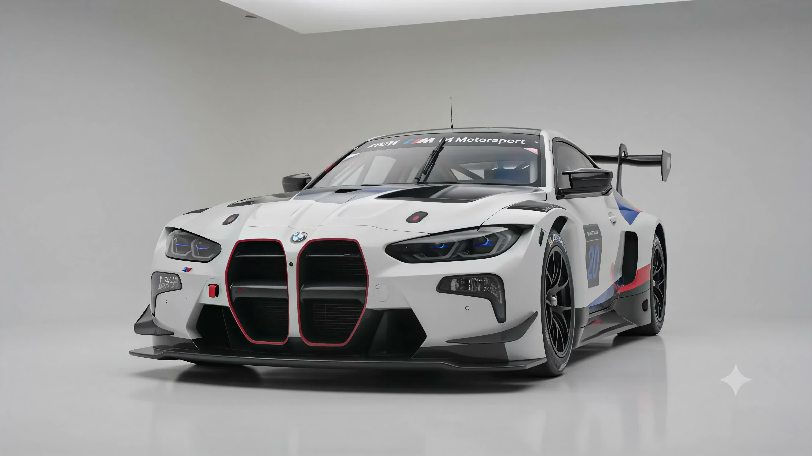

# BMW M4 GT3 EVO — Luxury Motorsport Showcase

Production-ready, Awwwards-grade luxury scrollytelling showcase for the **BMW M4 GT3 EVO** — BMW M Motorsport's latest evolution of its championship-winning GT3 race car.



## Features

- **HTML5 Canvas 192-Frame Sequence**: 100% full-screen cover canvas renderer with high-DPI Retina scaling (`devicePixelRatio`).
- **Master Scroll Synchronized HUD**: Single shared `scrollYProgress` MotionValue driving canvas frames and HUD phase transitions in sync over a `600vh` scroll track.
- **4 Sequence Phases**:
  - `01 / LEGACY` — BMW M4 GT3 EVO Hero Launch
  - `02 / AERODYNAMICS` — Downforce & Aero Package
  - `03 / COCKPIT` — 70° Butterfly Carbon Doors & Ergonomics
  - `04 / POWERTRAIN` — BMW P58 3.0L Twin-Turbo Inline-Six Engine
- **Pre-Flight Telemetry Preloader**: Interactive splash preloader with diagnostic logs, live loading counter, and `[START ENGINE]` launch button.
- **Web Audio Motorsport Synth Engine**: Web Audio API sound synthesizer with interactive HUD clicks, hover tones, telemetry beeps, and RPM audio tied to scroll velocity.
- **Drive Mode Selector**: Live `QUALIFYING`, `ENDURANCE`, and `WET` mode switches with dynamic HUD theme adjustments.
- **Interactive Vehicle Hotspots**: Pulsing telemetry pins over headlights, swan-neck wing, butterfly doors, and engine.
- **Technical Specs & Modals**: Tabbed specification grid and GT3 customer racing inquiry modals.

## Tech Stack

- **Framework**: Next.js 14 (App Router, TypeScript)
- **Styling**: Tailwind CSS v4 (`@theme` variables, Orbitron & Rajdhani Google Fonts)
- **Animation**: Framer Motion (`framer-motion`)
- **Smooth Scroll**: Lenis (`lenis`)
- **Graphics**: HTML5 Canvas (High-DPI Retina Render)

## Getting Started

First, install the dependencies:

```bash
npm install
```

Run the development server:

```bash
npm run dev
```

Open [http://localhost:3000](http://localhost:3000) with your browser to view the showcase.

## Build for Production

```bash
npm run build
npm run start
```

---

© 2025 BMW M Motorsport. Developed with Next.js 14 & Framer Motion.
