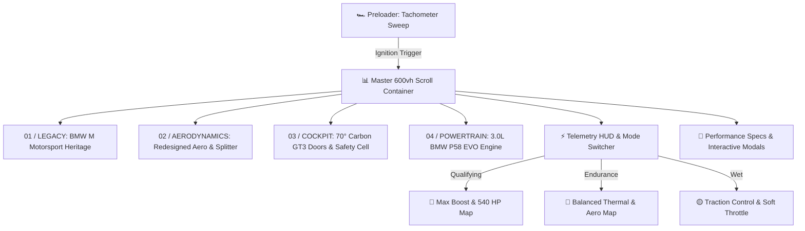

<div align="center">

# 🏎️ BMW M4 GT3 EVO
### Digital Showcase & Interactive Telemetry Experience

[](https://bmw-pi-ten.vercel.app/)
[](https://github.com/shajith23/bmw)

[](https://nextjs.org/)
[](https://reactjs.org/)
[](https://www.typescriptlang.org/)
[](https://tailwindcss.com/)
[](https://www.framer.com/motion/)
[](https://lenis.darkroom.engineering/)
[](https://bmw-pi-ten.vercel.app/)

<br />

<p align="center">
  <b>An ultra-premium, scroll-driven 360° digital experience built for the flagship BMW M4 GT3 EVO customer racing car.</b><br />
  Engineered with high-FPS HTML5 Canvas image sequences, real-time cockpit telemetry HUDs, dynamic drive modes, and browser-synthesized Web Audio API race engine acoustics.
</p>

[🌐 **Launch Live Demo**](https://bmw-pi-ten.vercel.app/) • [🏎️ **Experience Features**](#-key-features--experience-highlights) • [🎨 **Design System**](#-design-system--color-palette) • [🛠️ **Tech Architecture**](#%EF%B8%8F-technology-stack) • [🚀 **Quick Setup**](#-getting-started)

---

</div>

> [!TIP]
> **Live Production Deployment**: Experience the 360° interactive GT3 EVO sequence online at **[https://bmw-pi-ten.vercel.app/](https://bmw-pi-ten.vercel.app/)**.

---

## 🌟 Key Features & Experience Highlights

### 🔄 1. 600vh Master Scroll Canvas Engine
- **360° Frame Interpolation**: Smooth frame-by-frame 360-degree rotation driven by a **192-frame render sequence** (1.jpg to 192.jpg) rendered directly to an HTML5 2D Canvas context.
- **Scroll Physics Syncing**: Responsive scroll depth binding attached to a sticky 600vh scroll container powered by Framer Motion `useScroll` and `useMotionValueEvent`.

### ⚡ 2. Live Motorsport Telemetry & Drive Modes
Real-time cockpit HUD tracking race parameters across 3 distinct engine & aero profiles:

| Drive Mode | HP & Boost | Downforce | Visual Theme | Engine Sound Profile |
| :--- | :--- | :--- | :--- | :--- |
| 🔴 **QUALIFYING** | 540 HP (Max Boost) | Aggressive | M Red Accents | High RPM Aggressive Revs |
| 🔵 **ENDURANCE** | 510 HP (Stint Map) | Balanced | M Alpine Blue | Balanced Fuel & Thermal Tone |
| 🟡 **WET** | Soft Throttle | Max Mechanical | Rain Overlay | Traction Control Modulated |

### 🔊 3. Web Audio API Sound Engine
- **Real-Time Sound Synthesis**: Custom browser-based audio engine (`soundEngine`) generating realistic **engine revs**, **turbo spooling**, and **gear shift clicks** without external audio samples.
- **Interactive Audio Controls**: Mute toggle, RPM pitch bending, and mode transition sound effects.

### ⏱️ 4. Interactive Preloader
- Motorsport tachometer startup sequence featuring an animated **RPM needle sweep**, digital telemetry initialization checks, and a manual engine ignition start button.

### 📑 5. Technical Data & Customer Racing Modals
- **Technical Specs Modal**: Full FIA GT3 EVO engine specs, chassis dimensions, Xtrac 6-speed sequential ratios, and aero package.
- **Inquire Modal**: Seamless customer racing order & quotation request workflow.

---

## 🎨 Design System & Color Palette

Built around **BMW M Motorsport** visual heritage with high-contrast alpine dark/light styling:

```text
┌────────────────────────────────────────────────────────────────────────┐
│                          BMW M COLOR PALETTE                           │
├─────────────┬─────────────┬─────────────┬─────────────┬────────────────┤
│ Alpine White│ M Dark Navy │ M Light Blue│ M Dark Blue │ Motorsport Red │
│   #FFFFFF   │   #111111   │   #0066B1   │   #002B49   │    #E52521     │
└─────────────┴─────────────┴─────────────┴─────────────┴────────────────┘
```

- ⚪ **Alpine White (`#FFFFFF`)**: Clean canvas backdrop & high-contrast container surfaces.
- ⬛ **M Dark Navy (`#111111`)**: Deep cockpit typography & telemetry container backgrounds.
- 🟦 **M Light Blue (`#0066B1`)**: Primary active indicators, progress bars, and Endurance mode styling.
- 🔷 **M Dark Blue (`#002B49`)**: Secondary brand contrast and subtle borders.
- 🔴 **Motorsport Red (`#E52521`)**: Qualifying mode highlights, high-RPM tachometer rev lines, and primary call-to-actions.

---

## 🛠️ Technology Stack

```text
┌────────────────────────────────────────────────────────────────────────┐
│                          FRONTEND ARCHITECTURE                         │
├───────────────────┬───────────────────┬────────────────────────────────┤
│ Layer             │ Technology        │ Key Usage                      │
├───────────────────┼───────────────────┼────────────────────────────────┤
│ Framework         │ Next.js 14        │ App Router, SSR, Image Opt.    │
│ Language          │ TypeScript 5.6    │ Strict Type Definitions        │
│ Styling           │ Tailwind CSS v4   │ Utility Styling & Variables    │
│ Motion & Anim     │ Framer Motion 11  │ Scroll Progress & Transitions  │
│ Smooth Scroll     │ Lenis Scroll      │ Inertial Scroll Physics        │
│ Rendering         │ HTML5 2D Canvas   │ High-FPS 192-Frame Sequence    │
│ Sound Engine      │ Web Audio API     │ Real-time Synthesized Audio    │
│ Icons             │ Lucide React      │ Modern Vector UI Icons         │
│ Hosting           │ Vercel            │ Global Edge CDN & CI/CD        │
└───────────────────┴───────────────────┴────────────────────────────────┘
```

---

## 📁 Project Architecture

```text
bmw-m4-gt3-evo-showcase/
├── public/
│   └── images/
│       └── bmw-m4-gt3-evo-sequence/   # 192 high-res 360° render frames (1.jpg - 192.jpg)
├── src/
│   ├── app/
│   │   ├── globals.css                # Global styles, scrollbar styling, M brand tokens
│   │   ├── layout.tsx                 # Root layout & Lenis smooth scroll provider
│   │   └── page.tsx                   # Master 600vh scroll container & phase orchestrator
│   ├── components/
│   │   ├── BMWExperience.tsx          # Phase cards (Legacy, Aero, Cockpit, Powertrain)
│   │   ├── BMWScrollCanvas.tsx        # High-performance 2D Canvas sequence engine
│   │   ├── FeaturesSection.tsx        # GT3 EVO evolutionary feature grid
│   │   ├── Footer.tsx                 # Footer with brand links & inquiry action
│   │   ├── InquireModal.tsx           # Customer racing quote request modal
│   │   ├── LenisProvider.tsx          # Smooth scroll context wrapper
│   │   ├── Navbar.tsx                 # Telemetry header, drive mode switcher & audio toggle
│   │   ├── Preloader.tsx              # Motorsport RPM tachometer preloader screen
│   │   ├── SpecsGrid.tsx              # Performance specifications matrix
│   │   └── TechDataModal.tsx          # Complete FIA GT3 technical spec sheet
│   ├── data/
│   │   └── bmwData.ts                 # Structured race data, phases, & engine specs
│   └── utils/
│       ├── audio.ts                   # Web Audio API sound synthesizer engine
│       └── utils.ts                   # Tailwind merge utility helpers
├── .gitignore
├── next.config.mjs
├── package.json
├── README.md
└── tsconfig.json
```

---

## 🚦 Experience Sequence & Flow



---

## 🚀 Getting Started

### Prerequisites

- **Node.js** `v18.x` or higher
- **npm**, **pnpm**, **yarn**, or **bun**

### 1. Clone the repository
```bash
git clone https://github.com/shajith23/bmw.git
cd bmw
```

### 2. Install dependencies
```bash
npm install
```

### 3. Start development server
```bash
npm run dev
```
Open **[http://localhost:3000](http://localhost:3000)** in your browser to view the application locally.

### 4. Build for production
```bash
npm run build
npm start
```

---

## 🤝 Credits & Acknowledgments

- **BMW M Motorsport** for inspiring the visual identity, telemetry design, and engineering specifications of the M4 GT3 EVO.
- Built with ❤️ using Next.js, Framer Motion, Lenis, and Tailwind CSS.

---

<div align="center">

**[BMW M4 GT3 EVO Digital Experience](https://bmw-pi-ten.vercel.app/)** • Engineered for Customer Racing Performance.

</div>
